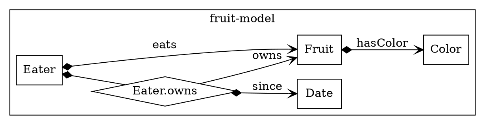
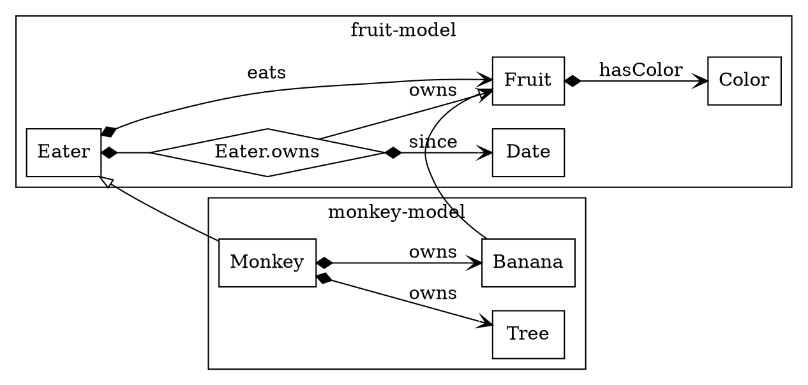

# Overview Weaver.Model


## Classes and relations


```yaml
name: fruit-model
version: 1.0.0

classes:
  Fruit:                       # fruit-model:Fruit
    relations:
      hasColor:
        range: Color
  Eater:                       # fruit-model:Eater
    relations:
      owns:                    # fruit-model:Eater.owns
        range: Fruit 
      eats:                    # fruit-model:Eater.eats
        range: Fruit 

  Eater.owns:                  # fruit-model:Eater.owns
    relations:
      since:                   # fruit-model:Eater.owns.since
        range: Date 
  
  Date:                        # fruit-model:Date
  Color:                       # fruit-model:Color
```


## Inherit from included model


```yaml
name: monkey-model
version: 1.0.0

includes:
  fm:
    name: fruit-model
    version: 1.0.0

classes:
  Monkey:
    super: fm.Eater            # fruit-model:Eater
    relations:
      ownsTree:                # monkey-model:Monkey.ownsTree
        range: Tree
        modelKey: owns
        card: [0, 1]
      ownsBanana:              # monkey-model:Monkey.ownsBanana
        range: Banana
        modelKey: owns
        card: [0, n]

  Monkey.owns:                 # monkey-model:Monkey.owns
    super: fm.Eater.owns       # fruit-model:Eater.owns
    relations:
      until:
        range: fm.Date         # fruit-model:Date

  Banana:                      # monkey-model:Banana

  Tree:                        # monkey-model:Tree

  Fruit:                       # monkey-model:Fruit
    super: fm.Fruit            # fruit-model:Fruit
    relations:
      hasColor:
        range: Color

  Color:                       # monkey-model:Color

```
