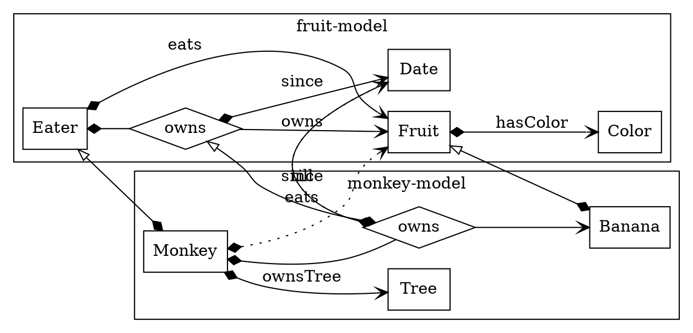

# Overview Weaver.Model

## 1. Intro
`Weaver.Model` is a concept that only exists SDK (client) side. It is a filtered way to interact with the *schemaless* graph data inside a Weaver Project.
- If it is used to create data it will function like a schema by validating the input.
- If used for reading from a mixed project data it will only show the nodes, attributes and relations the model describes and leave the others invisible.

### Definition

A model is defined in a `.yml` file:
```yaml
name: some-model
version: 1.0.0

classes:

  Thing
```

Which can be visualised in a UML-like diagram:


<details>
<summary></summary>
diagram_1
  digraph A {
    rankdir=LR;
    subgraph cluster_0 {
      label="some-model";
      rankdir=LR;
      node [shape = ellipse];
      Thing
    }
  }
diagram_1
</details>

Using the model in the SDK would look like this:

```coffee
# load model
m = ...
thing = new m.Thing()
```


## 2. Concepts

Concepts in the model are `classes`, `relations` and `attributes`. 
```yaml
name: some-model
version: 1.0.0

classes:

  Thing:

  Person:
    attributes:
      name:
        datatype: string
    relations:
      owns:
        range: Thing
```


<details>
<summary></summary>
diagram_2
  digraph B {
    rankdir=LR;
    subgraph cluster_0 {
      label="some-model";
      rankdir=LR;
      node [shape = ellipse];
      Person
      Thing
      name [label="_string_"; shape = box]
      Person -> name [label=name; arrowtail=diamond; arrowhead=vee; dir=both];
      Person -> Thing [label=owns; arrowtail=diamond; arrowhead=vee; dir=both];
    }
  }
diagram_2
</details>

And for the SDK:

```coffee
# load model
m = ...
thing = new m.Thing()
person = new m.Person()

person.set('name', 'Medic')
person.relation('owns').add(thing)
```

### Cardinality
An attribute can only have one value. It is either set or not. Requiring a certain attribute to be set can be done with the field `required`:
```yaml
  Person:
    attributes:
      name:
        datatype: string
        required: true
```

Any number of relations can be set. Controlling the amount of relations can be done with the `card` key:

```yaml
  Person:
    relations:
      owns:
        range: Thing
        card: [0, n]
```
### Meta relations

Relations can also be references as classes. However they should not be instantiated directly. This is prevented setting the flag `abstract` to `true`.
```yaml
name: some-model
version: 1.0.0

classes:

  Thing:

  Person:
    attributes:
      name:
        datatype: string
        required: true
    relations:
      owns:
        range: Thing
        card: [0, n]

  owns:
    abstract: true
    attributes:
      since: 
        datatype: datetime
        required: true
```


<details>
<summary></summary>
diagram_3
  digraph C {
    rankdir=LR;
    subgraph cluster_0 {
      label="some-model";
      rankdir=LR;
      node [shape = ellipse];
      Person
      Thing
      name [label="_string_"; shape = box]
      since [label="_datetime_"; shape = box]
      owns [label="owns"; shape = diamond]
      Person -> name [label=name; arrowtail=diamond; arrowhead=vee; dir=both];
      Person -> owns [label=""; arrowtail=diamond; arrowhead=none; dir=both];
      owns -> Thing [label=""; arrowhead=vee];
      owns -> since [label=since; arrowtail=diamond; arrowhead=vee; dir=both];
      {rank=same owns name since};
      since -> owns  [style="invis"];
    }
  }
diagram_3
</details>

### Model keys

Sometimes the relationship names are a long or complex. It is possible to use a simplified key in the model using the `modelKey`. The following model is equivalent with model above:

```yaml
name: some-model
version: 1.0.0

classes:

  Thing:

  Person:
    attributes:
      hasReferenceString:
        modelKey: name
        datatype: string
    relations:
      isInInheritanceGroupOf:
        modelKey: owns
        range: Thing
```

Still these keys in the interaction with the model can be used:
```coffee
person.set('name', 'Medic')         # name resolves to [some-model:]hasReferenceString
person.relation('owns').add(thing)  # owns resolves to [some-model:]isInInheritanceGroupOf
```

## 3. Inclusion and inheritence

Models can include each other. Concepts from the included model can be addressed by using the used prefix in the `includes` block. This prefix only exists in the context of the model performing the include.

```yaml
name: some-other-model
version: 1.0.0

includes:
  sm:
    name: some-model
    version: 1.0.0

classes:
  Brick:
    relations:
      partOf:
        range: sm.Thing
```

An inheritance link can be befined between classes using the `super` key.

```yaml
name: some-other-model
version: 1.0.0

includes:
  sm:
    name: some-model
    version: 1.0.0

classes:

  Doctor:
    super: sm.Person
    relations:
      operates:
        range: sm.Person
        
  Brick:
    relations:
      partOf:
        range: sm.Thing
```

This means instances of this class are also instances of the super class. So when a range points to the super class instances of this class are also acceptable.

Also, the class inherits the attribute and relation definitions of the super class. The `Doctor` class can have both `owns` and `operates` relations.

### Relations only inherit as class

It is not possible to redefine relations or attributes. Not within one model and not from included models. It is however possible to add for example the `till` attribute to the `owns` relation from the `some-model`.

```yaml
name: some-other-model
version: 1.0.0

includes:
  sm:
    name: some-model
    version: 1.0.0

classes:

  Doctor:
    super: sm.Person
    relations:
      operates:
        range: sm.Person
        
  Brick:
    relations:
      partOf:
        range: sm.Thing

  sm.owns:
    abstract: true
    attributes:
      till: 
        datatype: datetime
        required: false
```

```coffee
# load model
m = ...

thing = new m.sm.Thing()

doc = new m.Doctor()
rel = doc.relation('owns').add(thing)      # owns resolves to some-model:owns
rel.set('since', '2015-05-04T00:00:00Z')
rel.set('till', '2018-01-01T00:00:00Z')
```

Another possibility is to redefind a relation.
```yaml
name: some-other-model
version: 1.0.0

includes:
  sm:
    name: some-model
    version: 1.0.0

classes:

  Doctor:
    super: sm.Person
    relations:
      operates:
        range: sm.Person
      owns:
        range: Permit
        
  Brick:
    relations:
      partOf:
        range: sm.Thing

  Permit:

  owns:
    super: sm.owns
    abstract: true
    attributes:
      till: 
        datatype: datetime
        required: false
```

```coffee
# load model
m = ...

doc = new m.Doctor()

thing = new m.sm.Thing()

rel = doc.relation('owns').add(thing)      # owns resolves to some-model:owns
rel.set('since', '2015-05-04T00:00:00Z')
rel.set('till', '2018-01-01T00:00:00Z')

permit = new m.permit()

rel = doc.relation('owns').add(permit)     # owns resolves to some-other-model:owns
rel.set('since', '2015-05-04T00:00:00Z')
rel.set('till', '2018-01-01T00:00:00Z')
```

Note that the `some-model:owns` relation is also available to link to instances of the `Thing` class. Adding the `permit` to `onws` resolves to `some-other-model:owns` relation.

The specification of `some-other-model:owns` having super `some-model:owns` has no effect on resolving the `owns` modelKey. It only results in the inheritance of the meta attributes and relations like `since`.

## 9. Complete example


<details>
<summary></summary>
diagram_4
  digraph D {
    rankdir=LR;
    subgraph cluster_0 {
      label="fruit-model";
      rankdir=LR;
      node [shape = diamond];
      eaterOwns [label="owns"];
      node [shape = box];
      Eater -> Fruit [label=eats; arrowtail=diamond; arrowhead=vee; dir=both];
      Fruit -> Color [label=hasColor; arrowtail=diamond; arrowhead=vee; dir=both];
      Eater -> eaterOwns [label=""; arrowtail=diamond; arrowhead=none; dir=both];
      eaterOwns -> Fruit [label=owns; arrowhead=vee];
      eaterOwns -> Date [label=since; arrowtail=diamond; arrowhead=vee; dir=both];
    }
  }
diagram_4
</details>

```yaml
name: fruit-model
version: 1.0.0

classes:                                                      # domain                 # range

  Fruit:                       # fruit-model:Fruit
    relations:
      hasColor:                # fruit-model:hasColor         fruit-model:Fruit        fruit-model:Color
        range: Color           # fruit-model:Color

  Apple:
    super: Fruit

  Eater:                       # fruit-model:Eater
    relations:
      owns:                    # fruit-model:owns             fruit-model:Eater        fruit-model:Fruit
        range: Fruit 
      eats:                    # fruit-model:eats             fruit-model:Eater        fruit-model:Fruit
        range: Fruit 

  owns:                        # fruit-model:owns
    abstract: true
    relations:
      since:                   # fruit-model:since            fruit-model:owns         fruit-model:Date
        range: Date            # fruit-model:Date
  
  Date:                        # fruit-model:Date

  Color:                       # fruit-model:Color
```


Inherit from included model:

<details>
<summary></summary>
diagram_5
  digraph E {
    rankdir=LR;
    subgraph cluster_0 {
      label="fruit-model";
      eaterOwns [shape = diamond; label="owns"];
      node [shape = box];
      Eater; Fruit; Color; Fruit; Date
    }
    subgraph cluster_1 {
      label="monkey-model";
      node [shape = box];
      Monkey; Tree; Banana; monkeyOwns [shape = diamond; label="owns"];
    }
    Eater -> Monkey [abel=""; arrowtail=onormal; arrowhead=diamond; dir=both];
    Fruit -> Banana [label=""; arrowtail=onormal; arrowhead=diamond; dir=both];
    eaterOwns -> monkeyOwns [abel=""; arrowtail=onormal; arrowhead=diamond; dir=both];
    Monkey -> Fruit [label=eats; style=dotted; arrowtail=diamond; arrowhead=vee; dir=both];
    Monkey -> Tree [label="ownsTree"; arrowtail=diamond; arrowhead=vee; dir=both];
    Monkey -> monkeyOwns [label=""; arrowtail=diamond; arrowhead=none; dir=both];
    monkeyOwns -> Banana [label=""; arrowhead=vee];
    monkeyOwns -> Date [label=since; style=dotted; arrowtail=diamond; arrowhead=vee; dir=both];
    monkeyOwns -> Date [label=till; arrowtail=diamond; arrowhead=vee; dir=both];
    Eater -> Fruit [label=eats; arrowtail=diamond; arrowhead=vee; dir=both];
    Fruit -> Color [label=hasColor; arrowtail=diamond; arrowhead=vee; dir=both];
    Eater -> eaterOwns [label=""; arrowtail=diamond; arrowhead=none; dir=both];
    eaterOwns -> Fruit [label=owns; arrowhead=vee];
    eaterOwns -> Date [label=since; arrowtail=diamond; arrowhead=vee; dir=both];
  }
diagram_5
</details>



```yaml
name: monkey-model
version: 1.0.0

includes:
  fm:
    name: fruit-model
    version: 1.0.0

classes:                                                      # domain                 # range

  Monkey:                      # monkey-model:Monkey
    super: fm.Eater            # fruit-model:Eater
    relations:
      ownsTree:                # monkey-model:ownsTree        monkey-model:Monkey      monkey-model:Tree
        range: Tree            # monkey-model:Tree
        modelKey: owns
        card: [0, 1]
      owns:                    # monkey-model:owns            monkey-model:Monkey      monkey-model:Banana
        range: Banana          # monkey-model:Banana
        modelKey: owns
        card: [0, n]

  owns:                        # monkey-model:owns
    super: fm.owns             # fruit-model:owns
    abstract: true
    relations:
      till:                    # monkey-model:till            monkey-model:owns        fruit-model:Date
        range: fm.Date         # fruit-model:Date

  Banana:                      # monkey-model:Banana
    super: fm.Fruit            # fruit-model:Fruit

  Tree:                        # monkey-model:Tree

  Color:                       # monkey-model:Color

```

