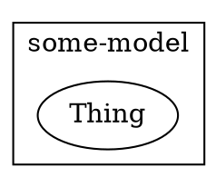
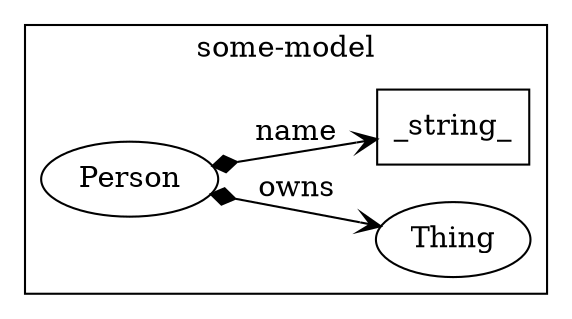
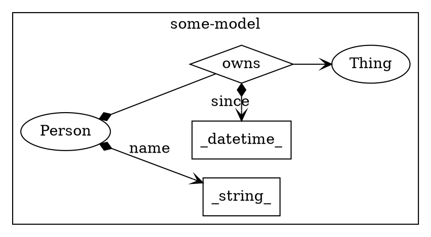
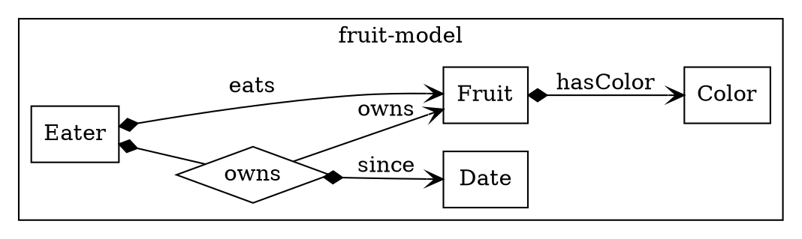
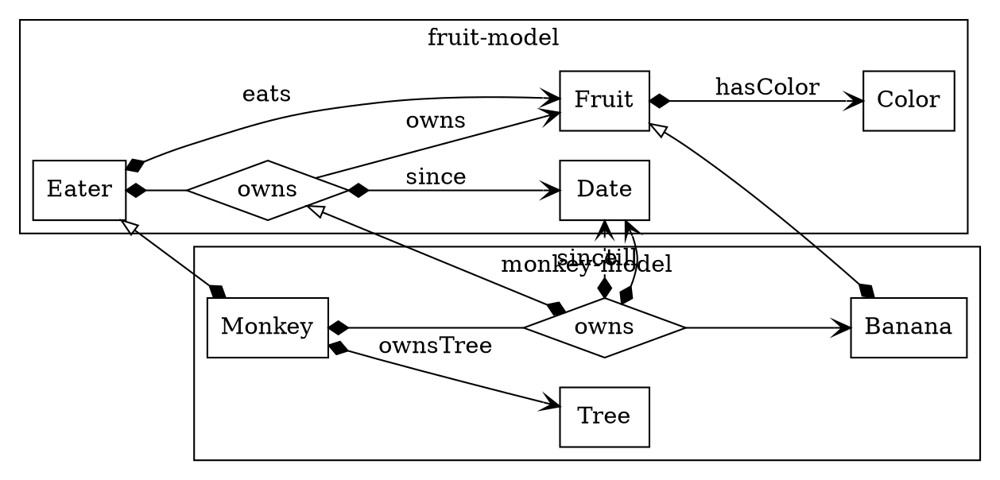

# Overview Weaver.Model

## 1. Intro
`Weaver.Model` is a concept that only exists SDK (client) side. It is a filtered way to interact with the *schemaless* graph data inside a Weaver Project.
- If it is used to create data it will function like a schema by validating the input.
- If used for reading it will show these nodes, attributes and relations the model describes.

### Definition

A model is defined in a `.yml` file:
```yaml
name: some-model
version: 1.0.0

classes:
  Thing
```

Which can be visualised in a UML-like diagram:



<details> 
<summary></summary>
custom_mark10
	digraph {
		rankdir=LR;
		subgraph cluster_0 {
			label="some-model";
			rankdir=LR;
			node [shape = ellipse];
			Thing
		}
	}
custom_mark10
</details>

```

<details> 
<summary></summary>
custom_mark10
	digraph {
		rankdir=LR;
		subgraph cluster_0 {
			label="some-model";
			rankdir=LR;
			node [shape = ellipse];
			Thing
		}
	}
custom_mark10
</details>
```


### Concepts

Concepts in the model are `classes`, `relations` and `attributes`. 
```yaml
name: some-model
version: 1.0.0

classes:
  Thing:
  Person:
    attributes:
      name:
        datatype: string
    relations:
      owns:
        range: Thing
```



### Punning

Relations can also be references as classes.
```yaml
name: some-model
version: 1.0.0

classes:
  Thing:
  Person:
    attributes:
      name:
        datatype: string
    relations:
      owns:
        range: Thing
  owns:
    attributes:
      since: 
        datatype: datetime
```



## 2. Inclusion and inheritence


```yaml
name: fruit-model
version: 1.0.0

classes:
  Fruit:                       # fruit-model:Fruit
    relations:
      hasColor:
        range: Color
  Eater:                       # fruit-model:Eater
    relations:
      owns:                    # fruit-model:owns
        range: Fruit 
      eats:                    # fruit-model:eats
        range: Fruit 

  owns:                        # fruit-model:owns
    relations:
      since:                   # fruit-model:since
        range: Date 
  
  Date:                        # fruit-model:Date
  Color:                       # fruit-model:Color
```


Inherit from included model:


```yaml
name: monkey-model
version: 1.0.0

includes:
  fm:
    name: fruit-model
    version: 1.0.0

classes:
  Monkey:
    super: fm.Eater            # fruit-model:Eater
    relations:
      ownsTree:                # monkey-model:ownsTree
        range: Tree
        modelKey: owns
        card: [0, 1]
      owns:                    # monkey-model:owns
        range: Banana
        modelKey: owns
        card: [0, n]

  owns:                        # monkey-model:owns
    super: fm.owns             # fruit-model:owns
    relations:
      till:
        range: fm.Date         # fruit-model:Date

  Banana:                      # monkey-model:Banana

  Tree:                        # monkey-model:Tree

  Fruit:                       # monkey-model:Fruit
    super: fm.Fruit            # fruit-model:Fruit
    relations:
      hasColor:
        range: Color

  Color:                       # monkey-model:Color

```
